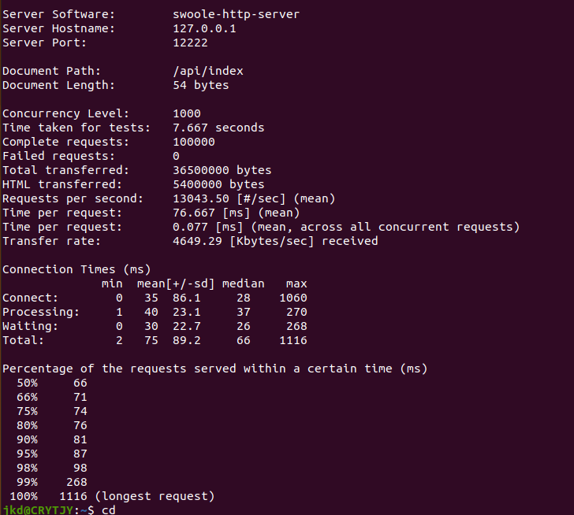

# JKDYAF - V2.2.1

## 基于 YAF + SWOOLE APi框架
           ____ __ ______  _____    ______
          / / //_// __ \ \/ /   |  / ____/
     __  / / ,<  / / / /\  / /| | / /_
    / /_/ / /| |/ /_/ / / / ___ |/ __/
    \____/_/ |_/_____/ /_/_/  |_/_/

### 

### 介绍

简单、直接、非传统

JkdYaf 一个简单、高性能常驻内存的PHP框架。

基于Yaf与Swoole开发，性能较传统基于 PHP-FPM 的框架有质的提升。

一款专为Api开发的轻量级框架。一款面向中小型企业级项目的高可用、低门槛PHP开源框架。

### [详细文档](http://jkdyaf.crytjy.com/)



### 特性

- HTTP 服务
- Redis连接池
- Jwt 认证
- 协程化
- 定时任务
- 日志管理
- 路由管理
- Yac无锁共享内存
- 注解AOP
- 中间件
- Mysql连接池

### 服务器要求
- php 7.x 或更高版本
- yaf 3.3.x 或更高版本
- swoole 4.5.x 或更高版本
- mysql
- redis
- yac


### 安装JkdYaf

```bash
git clone https://github.com/crytjy/JkdYaf.git
```


### php.ini配置

```bash
extension=yaf.so
[yaf]   
yaf.environ=product
yaf.cache_config=1
yaf.use_namespace=1
yaf.library="/path/JkdYafLibrary/"  //全局类库的目录路径
    
extension=yac.so
[yac]
;是否开启yac,1表示开启, 0表示关闭
yac.enable=1 
;4M可以得到32768个key, 32M可以得到262144个key
yac.keys_memory_size=4M
;申请的最大value内存
yac.values_memory_size = 64M 
;是否压缩数据ss
yac.compress_threshold = '-1' 
;关闭在cli下使用yac
yac.enable_cli = 1
```

### app.ini配置

项目conf/app.ini

```ini
[common]
application.directory = APP_PATH "/app"
application.dispatcher.catchException = TRUE
application.dispatcher.throwException = TRUE
;本地类库
application.library = APP_PATH "/library"
application.library.namespace = "Com"
;多模块（多个模块）
application.modules = "Api"
;域名
siteUrl = "http://localhost/"
;公共类库路径 （该路径必须和php.ini配置里填写的一致）
comLibsPath = "/www/wwwroot/yaf/yafLibrary/"
;接口请求有效时间间隔
apiTs = 60

#日志配置
[log]
;日志保留天数
log.day = 7
;日志路径
log.path = APP_PATH "/runtime/log/"

[product : common : log]
```

### jkdYaf.ini配置

项目conf/jkdYaf.ini

```ini
; JKDYAF 配置
[common]
ip = "0.0.0.0"
port = 12222    //监听端口，随意改
app_name = JkdYaf   //项目名称（英文），多个项目时区分
master_process_name = JkdYaf-Master
manager_process_name = JkdYaf-Manager
event_worker_process_name = JkdYaf-Worker-%s
event_tasker_process_name = JkdYaf-Tasker-%s

; 记录master和manager的进程id
pid_file = APP_PATH "/runtime/master.pid"
; 记录worker的进程id
worker_pid_file = APP_PATH "/runtime/worker.pid"
; 记录tasker的进程id
tasker_pid_file = APP_PATH "/runtime/tasker.pid"
; 记录timer的进程id
timer_pid_file = APP_PATH "/runtime/timer.pid"

; 以下参数根据服务器配置相应改动
[server]
process_num = 1
worker_num = 4
max_request = 30000
dispatch_mode = 3
log_file = APP_PATH "/runtime/swoole.log"
log_rotation = SWOOLE_LOG_ROTATION_DAILY

[product : common : server]
```

### 启动

配置好后，进入项目根目录，启动项目

```bash
cd /yaf/
php bin/JkdYaf.php start 
php bin/JkdYaf.php start -d  //守护进程
```

浏览器访问 `http://localhost:12222/api/index`

> {"code":1,"message":"success","data":"Hello JkdYaf !"}
