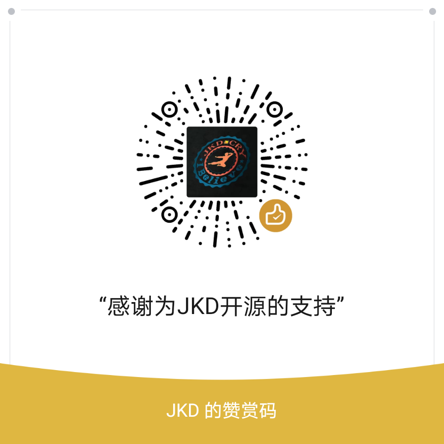

# JKDYAF

## 基于 YAF + SWOOLE 高性能API框架
           ____ __ ______  _____    ______
          / / //_// __ \ \/ /   |  / ____/
     __  / / ,<  / / / /\  / /| | / /_
    / /_/ / /| |/ /_/ / / / ___ |/ __/
    \____/_/ |_/_____/ /_/_/  |_/_/

### 项目架构
- Linux + Nginx + PHP7 + Mysql + Swoole + Redis + Yaf + Yac

### 必需
- php 7.x
- mysql
- yaf
- yac
- swoole 5.4.x
- redis

### 为什么要写这个项目？
我最开始用laravel写接口，但众所周知laravel框架是一个非常重的，性能更是没得说。   
肯定有人会问，既然追求性能，为什么不用现在很火的Golang来写，性能杠杠的。其实我最开始也是想用Golang来写的，但是本人对Golang并不熟悉，时间成本太高。    
之所以选择YAF，无可厚非就是因为快，简单。并且作为鸟哥的头号粉丝，必定会选择YAF。    
最开始我也是寻找网上的开源项目，但并没有找到一个是我满意的。不是没有用上swoole,就是不支持多模块，都有的就是封装了太多东西。    

### 配置
##### 1. 修改php.ini配置
    extension=yaf.so
    [yaf]   
    yaf.environ=product
    yaf.cache_config=1
    yaf.use_namespace=1
    yaf.library="/path/JkdYafLibrary/"  //全局类库的目录路径
        
    extension=yac.so
    [yac]
    ;是否开启yac，1表示开启， 0表示关闭
    yac.enable=1 
    ;4M可以得到32768个key， 32M可以得到262144个key
    yac.keys_memory_size=4M
    ;申请的最大value内存
    yac.values_memory_size = 64M 
    ;是否压缩数据ss
    yac.compress_threshold = '-1' 
    ;关闭在cli下使用yac
    yac.enable_cli = 1

##### 2. 项目app.ini,修改数据库mysql与redis的配置
    #数据库配置mysql
    [db]
    db.host = "x.x.x.x"
    db.port = xxxx
    db.dbname = "xx"
    db.username = "xx"
    db.password = "xxx"
    db.charset = "utf8mb4"
    
    #redis配置
    [redis]
    redis.host = "x.x.x.x"
    redis.port = xxx
    redis.password = null

##### 3. 项目修改jkdyaf.ini配置
    ip = "0.0.0.0"
    port = 9501

### 启动
    php bin/JkdYaf.php start 
    php bin/JkdYaf.php start -d  //守护进程
    
### nginx 配置
    server {
        listen       xx; //端口
        server_name  x.x.x.x; //IP或者域名
        index index.html index.htm index.php;
        root /path/JkdYaf/public/;     //项目路径
    
        location = /favicon.ico {
            return 404;
            expires 30d;
            log_not_found off;
            access_log off;
        }
    
        location / {
            if (!-e $request_filename){
                proxy_pass http://127.0.0.1:9501;   //必须与项目conf下的JkdYaf.ini对应
            }
        }
    
        location ~ .*\.(gif|jpg|jpeg|png|bmp|swf)$
        {
            expires 30d;
        }
    
        location ~ .*\.(js|css)?$
        {
            expires 1h;
        }
    }
  
    
## 后续将会继续添加常用功能
- mysql连接池
- redis连接池
- 定时任务
- yaconf
- yar
- 队列

## 打赏

